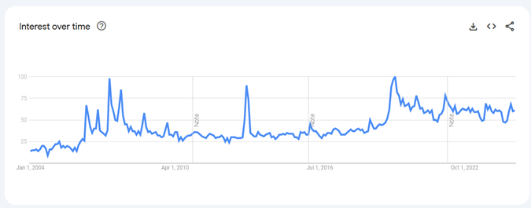

# CSC3310 Final Project - Team C: Fast Fourier Transform (FFT)

## Team Members

- Adam Haile
- Aiden Miller
- Leigh Goetsch

## Project Description

Our project uses the FFT algorithm to encrypt and decrypt a cyptocurentcy wallet for a new meme coin we created called Big Brain Coin.

## Project Details

### About Fast Fourier Transform (FFT)

#### Overview

The Fast Fourier Transform (FFT) is an algorithm that computes the Discrete Fourier Transform (DFT) of a sequence. It is an optimized version of the DFT that takes advantage of the symmetry of the DFT matrix to reduce the number of operations required to compute the DFT from O(n^2) to O(n log n). The FFT is widely used in signal processing, image processing, and other applications where the DFT is needed.

#### Background

The DFT was first introduced by Gauss in 1805, but it was not widely used until the 20th century when the FFT algorithm was developed. The FFT was first described by Cooley and Tukey in 1965, and it has since become one of the most important algorithms in computer science.

#### How it Works

FFT works by recursively dividing the input sequence into two halves, computing the DFT of each half, and then combining the results to compute the DFT of the entire sequence. This process is repeated until the sequence is small enough to compute the DFT directly.

#### Discussion

##### Benefits

The FFT is much faster than the DFT for large sequences, making it ideal for real-time applications where speed is important. It is also more efficient in terms of memory usage, as it requires only O(n log n) memory compared to O(n^2) for the DFT.

##### Limitations

The FFT is not suitable for all applications, as it requires the input sequence to be a power of 2 in length. It is also more complex to implement than the DFT, so it may not be the best choice for simple applications.

#### Comparison with Other Algorithms

##### DFT

The DFT is a straightforward algorithm that computes the Fourier Transform of a sequence by summing the products of the sequence with complex sinusoids at different frequencies. It is simple to implement, but it is slow for large sequences due to its O(n^2) time complexity.

##### Goertzel Algorithm

The Goertzel algorithm is a specialized version of the DFT that is optimized for computing the Fourier Transform at a single frequency. It is faster than the DFT for this specific case, but it is not as general-purpose as the FFT.

### About Big Brain Coin

#### Overview

Big Brain Coin is a new meme coin that was created by our team for the purpose of this project.

#### FFT Encryption

We use the FFT algorithm in place of standard RSA encryption for key generation, encryption, and decryption of the Big Brain Coin wallet. Our current implementation of the Big Brain Coin wallet is not secure and should not be used for storing real cryptocurrency. There are [papers](https://arxiv.org/pdf/1810.07177) that lend credibility to the idea of using the FFT for encryption.

#### Market Analysis

The search for "Big Brain" has been on a slight steady upward trend over time. This is a good sign for the future of Big Brain Coin. Additionally:

- The meme coin market is "exploding" with [interest over 2024](https://news.bitcoin.com/meme-coins-take-2024-by-storm-sector-explodes-with-93-billion-growth/)
- The market recently grew to a market cap of $117.28B (+$93B)
- Scandals like the recent $HAWK scandal highlight the volatility of the sector.

This shows how the meme coin market is large and growing, but also volatile and risky.

#### Business Model

- Start with 21% of the coins in known pool
- Sell 5% to investors as an initial market fund, with an additional 2:1 gift for 10% to investors
- The initial value of a coin is equal to initial fund spread over all the coins in circulation
